# CELO React Cinema Dapp

## Table of Contents

-   [Description](#description)
-   [Live demo](#live-demo)
-   [Tech Stack](#tech-stack)
-   [Installation](#quick-start)
-   [Smart-Contract Deployment](#smart-contract-deployment)
-   [Usage](#usage)
-   [Site Overview](#site-overview)
-   [License](#license)

# Description

This is a web application for cinema management that allow clients to book and buy tickets to different movie sessions. Every ticket is auto-generated NFT that contains QR code with a link to the view ticket page. If client scan his qr code he can information about a purchased ticket. Clients can only open information page of a ticket they own.

If manager scans client's qr code ticket (owner can add managers), he can change status of a ticket.
Real usage example:
1. Client shows his ticket (qr code) on the film session.
2. Manager scans his code and changes status of a ticket to used.

Web application has 4 pages - index(with list of movies), admin panel, user profile and ticket information page.Client has opportunity to see a list of available seats and already occupied ones by another users. The client can also purchase some tickets to different sessions at once.

There is admin panel on the site, owner and managers can access it and manipulate data. Admin panel has a managers page, where only owner can add and remove managers addresses to and from the list.

The information about films, sessions and tickets is saved on the blockchain and users cannot manipulate with contract without rights to do it.

Every ticket qr code is auto-generated and stores by pinata api

# Live Demo

[LINK TO DEMO](http://celo-react-cinema-dapp.surge.sh)

# Tech Stack
This Dapp uses the following tech stack:
- [React](https://reactjs.org) - A JavaScript library for building user interfaces.
- [use-Contractkit](contractkit) - A frontend library for interacting with the Celo blockchain.
- [Hardhat](https://hardhat.org) - A tool for writing and deploying smart contracts.
- [React Bootstrap](https://react-bootstrap.github.io) - A CSS framework that provides responsive, mobile-first layouts.
- [Axios](https://axios-http.com) - A promise-based HTTP client for node.js. Used to send requests to pinata api.
- [react-toastify](https://www.npmjs.com/package/react-toastify) - Javascript library for non-blocking notifications.
- [Flatpickr](https://flatpickr.js.org/getting-started) - Lightweight Javascript datetime picker.
- [QRcode](https://www.npmjs.com/package/qrcode) - QRcode generator.

# Quick Start

To get this project up running locally, follow these simple steps:

### Clone the repository:

```sh
git clone https://github.com/nadiarei/celo-react-cinema-dapp.git
```

### Navigate to the directory:

```sh
cd celo-react-cinema-dapp
```

### Install the dependencies:

```sh
npm ci
```

### Run the dApp locally:

```sh
npm start
```

### Build

```sh
npm run build
```

To test the dapp you will need to have a wallet(for example, metamask) with CELO Alfajores testnet [tokens](#usage).

# Smart-Contract Deployment

To deploy smart contracts that the dapp will interact with by, check the following steps below:

## Compile the smart contract

```sh
npx hardhat compile
```

or

```sh
npm run compile
```

### Set env file

- Rename file .env-example to .env
- Paste your mnemonic key from wallet as MNEMONIC
- Paste your JWT pinata api token as REACT_APP_PINATA_BEARER_KEY

```js
MNEMONIC = ""
REACT_APP_PINATA_BEARER_KEY=""
```

## Deploy the smart contract to the Celo testnet Aljafores

In the client directory
```sh
npx hardhat run --network alfajores scripts/deploy.js
```

or

```sh
npm run deploy
```

This command will update the src/contract files with the deployed smart contracts ABI and contract address.

# Usage
1. Install the wallet, for example [Metamask](https://chrome.google.com/webstore/detail/metamask/nkbihfbeogaeaoehlefnkodbefgpgknn) from the google chrome store.
2. Create a wallet.
3. Go to [https://celo.org/developers/faucet](https://celo.org/developers/faucet) and get tokens for the alfajores testnet.
4. Switch to the alfajores testnet in the Metamask.

# Site Overview

## Client side

When we open a site we will see a white screen and wallet authorization window.
[<p align="center">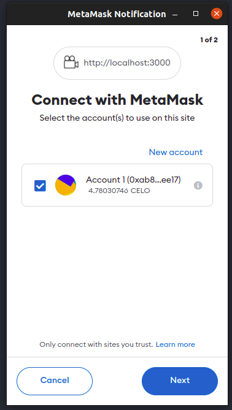</p>][def]

After successfull authorization we see an index page. On the menu there are "Admin panel" (only owner and managers can see this link) and "My profile" links.
On the content block there are blocks of movies(poster, title and "Watch sessions" button).
[<p align="center">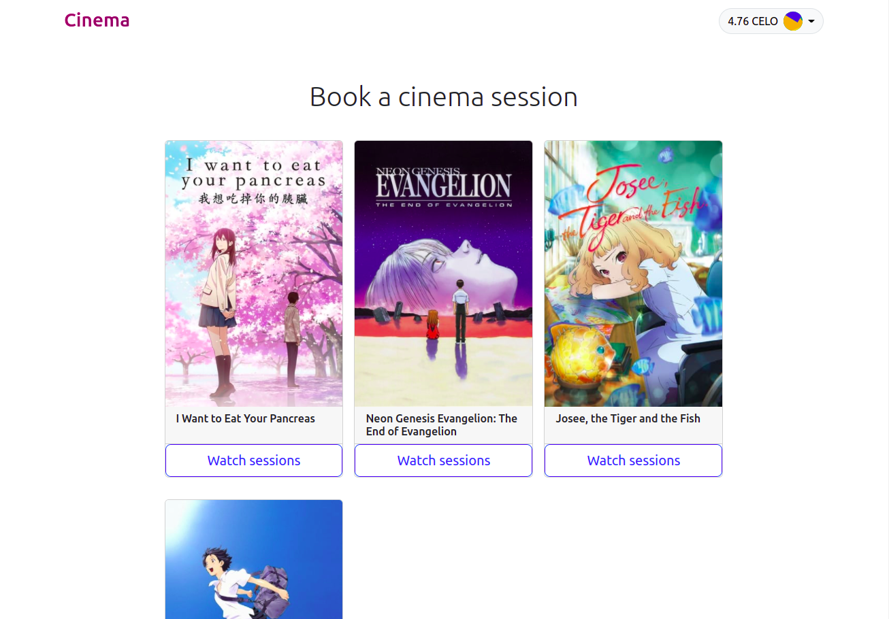</p>][def]

After clicking on the "Watch sessions" button we see a modal window with list of not expired session. Every session has specific date and time, amount of seats and price per one seat. Also, user can see occupied seats (they are invalid to select for the user).
[<p align="center">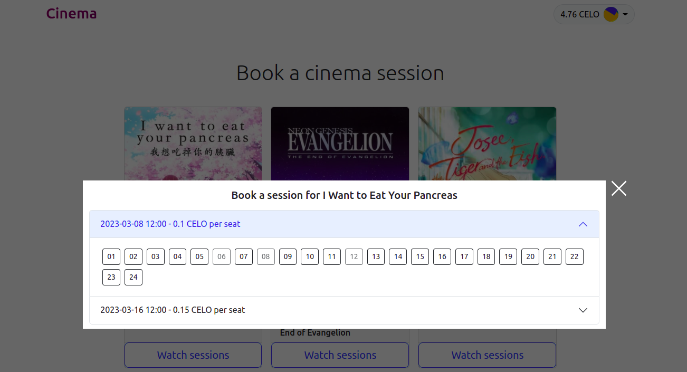</p>][def]

After selection of seats to purchase, we see a notification and an informational block about a puchase on the page.
[<p align="center">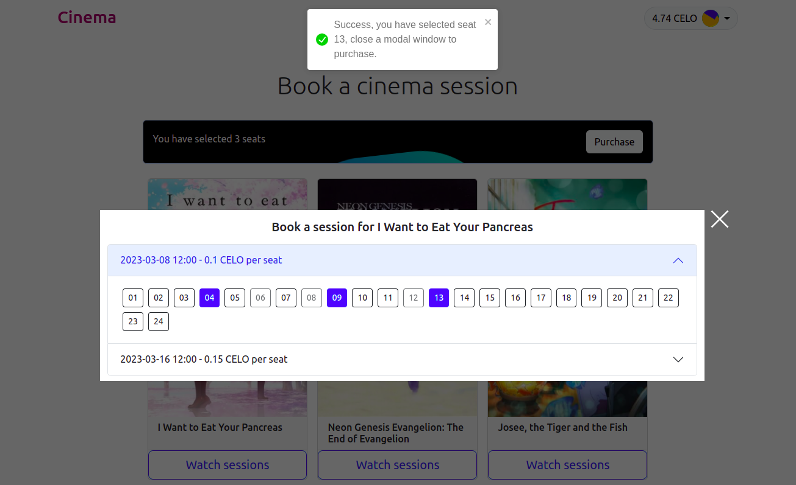</p>][def]

We can remove a ticket from cart if we click again on the seat button.
[<p align="center">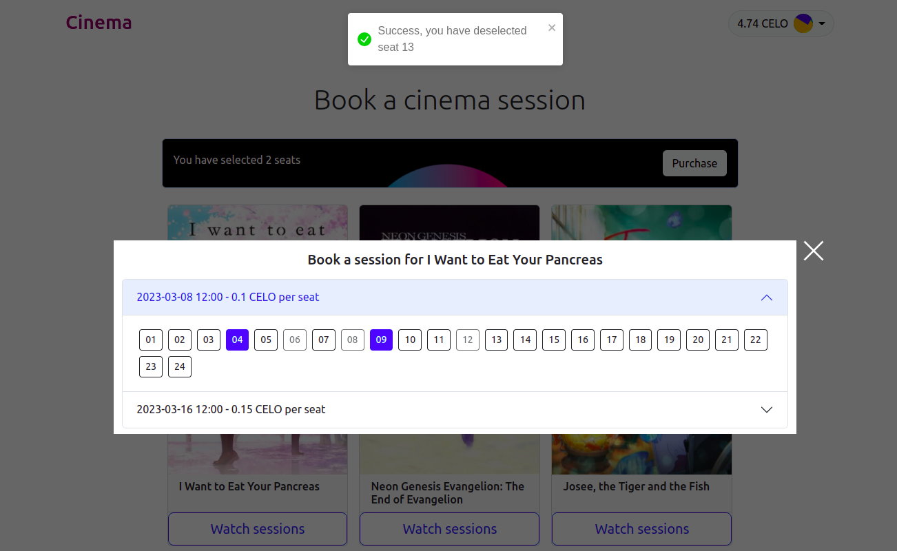</p>][def]

To purchase a tickets, we click on the "Purchase button" and see purchasing window with an information about added seats and total price. We can remove seats from here too.
[<p align="center">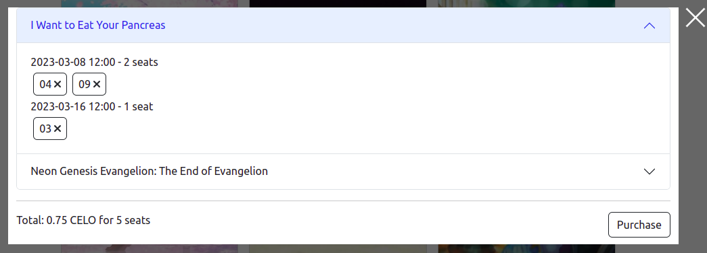</p>][def]

We need to pay a total price and gas fees to purchase tickets.
[<p align="center">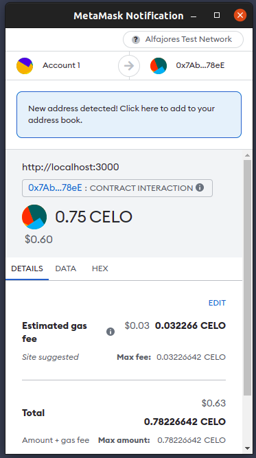</p>][def]

After a purchase, ticket NFTs will be generated and uploaded to pinata.
[<p align="center">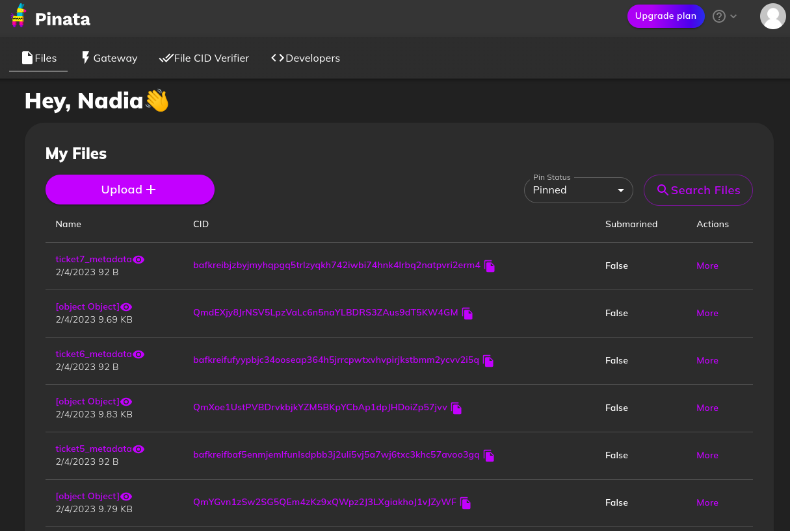</p>][def]

After successfull payment we can see our tickets with their status(used or not used) on the profile page.
[<p align="center">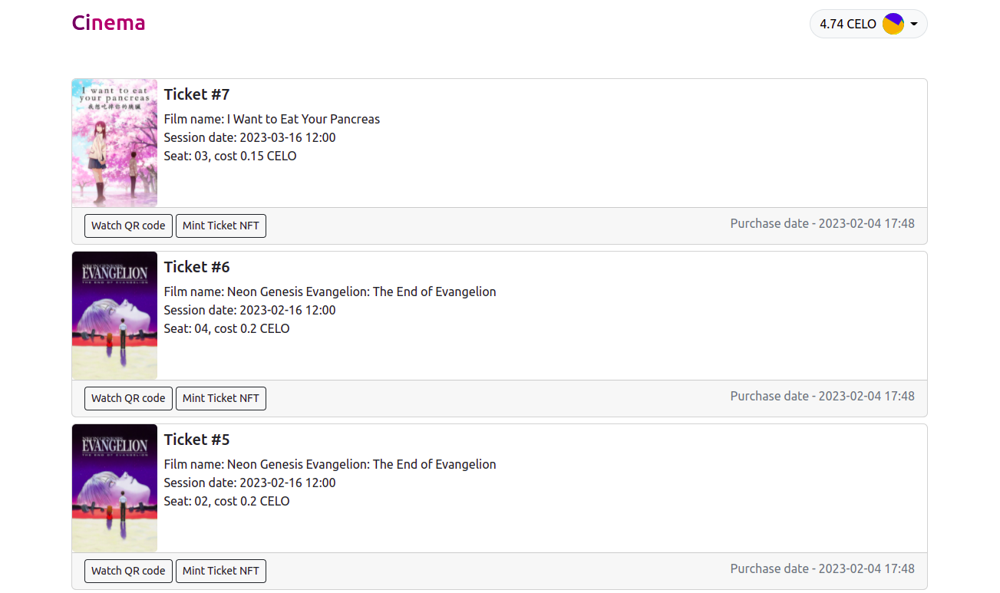</p>][def]

Client can watch ticket QR code by clicking on the "Watch QR code" button.
[<p align="center">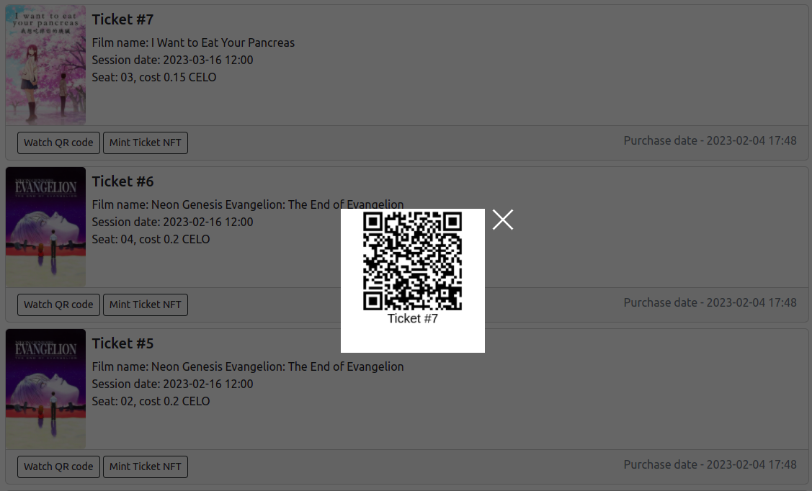</p>][def]

Also, client can mint ticket qr code as NFT by clicking on the "Mint Ticket NFT" button.
[<p align="center">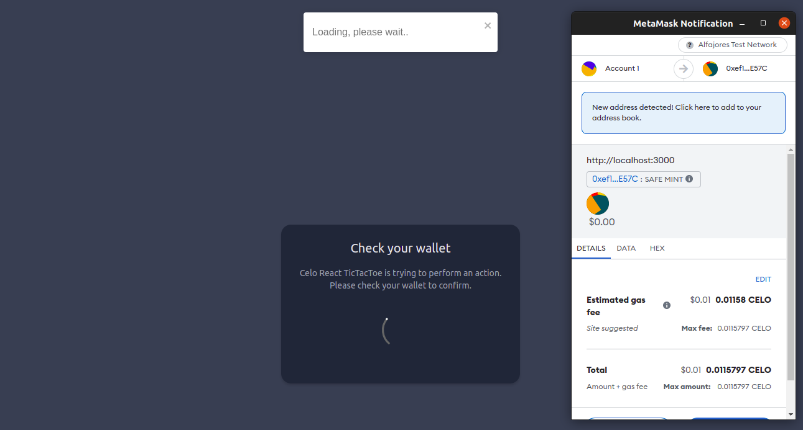</p>][def]

Mint nft button will change to "Watch minted NFT".
[<p align="center">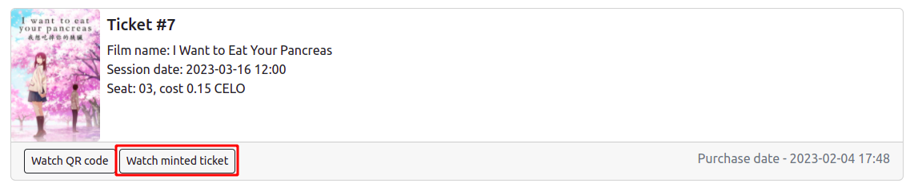</p>][def]

NFT view on the CELO explorer:
[<p align="center">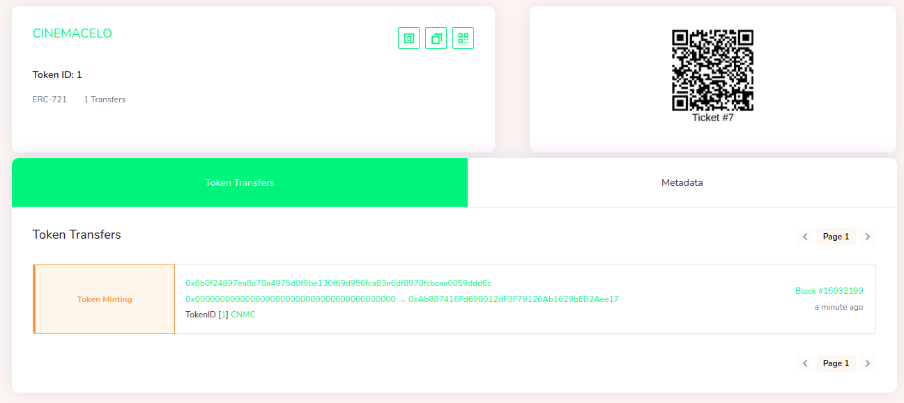</p>][def]

After scanning qr code, ticket info page will open. <br />
###NOTE: Only owner or manager that scans a qr code of a ticket and opens ticket information page, can change status of a ticket. Client will not see this button.
[<p align="center">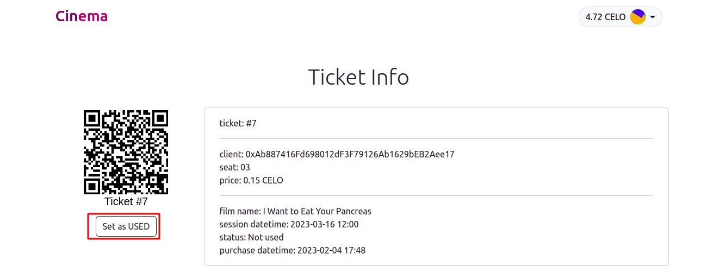</p>][def]

---

## Admin side

###NOTE. To manipulate with data we will need to pay gas fees, for example, to create/update/remove films or sessions.

On the admin panel as owner we see 3 toggles: Films, Purchased tickets and Managers. Only owner can watch/add/remove managers.

### Films toggle
On the films toggle we see a table with films (id, name of the film, link to the poster image, sessions and actions).
[<p align="center">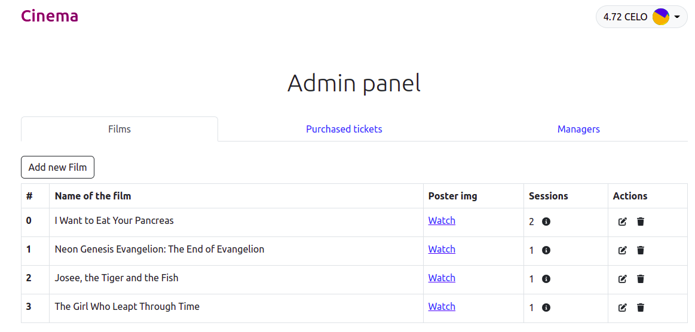</p>][def]

When we click on the information about session button, we see a modal window with table of sessions, where we can add session or change some of the already existing ones.
[<p align="center"></p>][def]

On the session creating/updating window we can choose a date and time, amount of seats and seat price in CELO.
[<p align="center">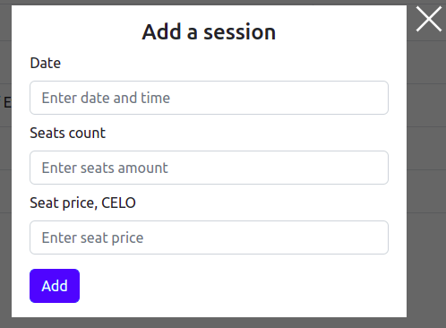 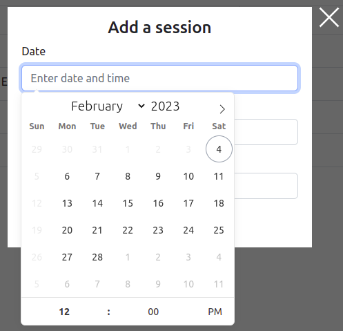</p>][def]

### Purchased tickets toggle

On this toggle we see a list of all clients and their purchased tickets, we can look at the information about the purchase and change a status of ticket(set it as used or not used)
[<p align="center">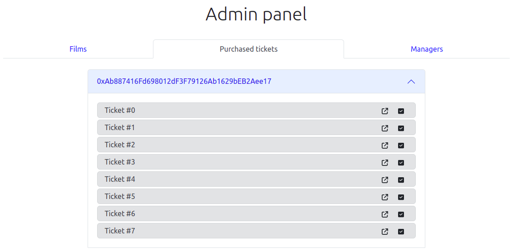</p>][def]

Information about ticket modal window.
[<p align="center">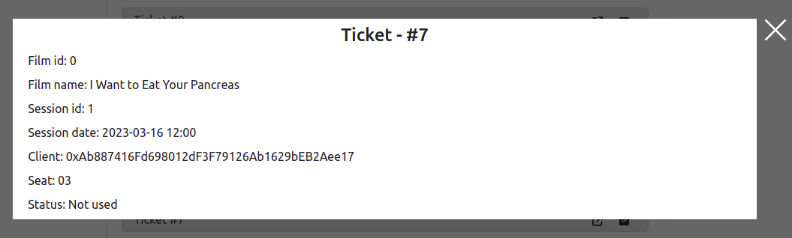</p>][def]

### Managers toggle

On this toggle we see a form that allows to add new manager and a list of added managers. We can remove a manager from list if we click on the trash button. Only owner can do actions with managers.
[<p align="center">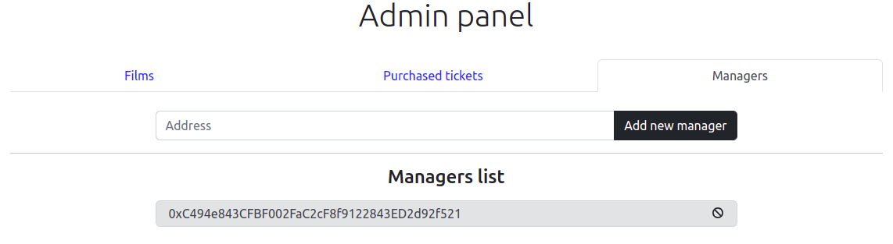</p>][def]

If we try to add already existing manager's address, we will get an error notification.
[<p align="center">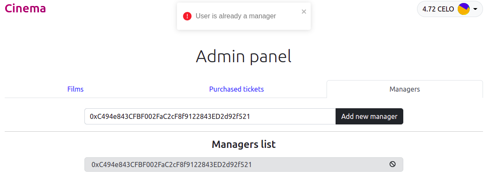</p>][def]

---

## License
> [MIT License](https://opensource.org/licenses/MIT) &copy; [LICENSE](LICENSE)

[def]: screenshots